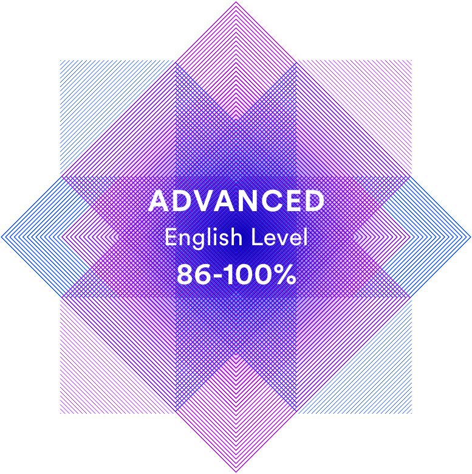

# Kseniya Egorushkova - @Grinchcreator


A curious Junior Frontend Developer. I learn quick and am always ready for some challenge.


## Contacts

[Email](mailto:xgreenwich97@gmail.com) | [Github](https://github.com/Grinchcreato) |  [Telegram](t.me/drug.tribe)

## About me

Originally I'm an English teacher at a language school. Not so long ago I got interested in frontend. I'm just a junior but I've got enough passion to keep learning. 
I like interesting challenges where I can test my skills and, of course, learn something new. 

## Skills

* HTML
* CSS
* Git
* Javascript
* JQuery
* Figma

## Code (this is an example of my own code for frontend mentor Interactive Card Form challenge)

```
//JQuery code goes here
let $confirmAll = $("#submit");
let $close_Window1 = $(".input-wrapper1");
let $close_Window2 = $(".input-wrapper2");
let $Thank_You_Window = $(".thank_you"); 

//open & close on click by checking if the conditions are true
$confirmAll.on("click", function confirmCheck(){
if($("#card_month").length > 0 && $("#card_month").val() <= 12 && $("#card_month").val().length == 2 && $("#card_month").val() !=0 &&
$("#card_cvc").val() !=0 && $("#card_cvc").val().length == 3 &&
$("#card_number").val() !=0 && $("#card_number").val().length == 16 &&
$("#card_year").val() !=0 && $("#card_year").val().length == 2 && $("#card_year").val() > 0 &&
/^[0-9]+$/.test($("#card_number").val()) &&
/^[0-9]+$/.test($("#card_cvc").val()) &&
/^[a-zA-Z]+ [a-zA-Z]+$/.test($("#card_name").val())
)
{
$close_Window1.hide();
$close_Window2.hide();
$confirmAll.hide();
$Thank_You_Window.show();} else {console.log("One of the conditions holds false");}
});
//jquery code finishes here

```

## My projects

* ### Personal Website https://github.com/Grinchcreator/Personal-Website
* ### Quiz https://github.com/Grinchcreator/Harry-Potter-Quiz-RU
* ### Interactive Form https://github.com/Grinchcreator/Interactive-Form
* ### API Advice App https://github.com/Grinchcreator/Advice-Generator-App
* ### Landing page https://github.com/Grinchcreator/huddle-landing-page-with-a-single-introductory-section

## Education and certificates

* YSPU (Foreign Languages)
* Introduction to JS (Sololearn)
* jQuery (Sololearn)
* JS from Scratch (upGrad)
* Responsive Web Design (Sololearn)
* Modern Web Design (Gymnasium)
* Responisve Web Design (Gymnasium)
* Web Development (IRS Academy)

## Languages

* Russian (native)

* English (C1)



* German (A2)

* JS ;)
